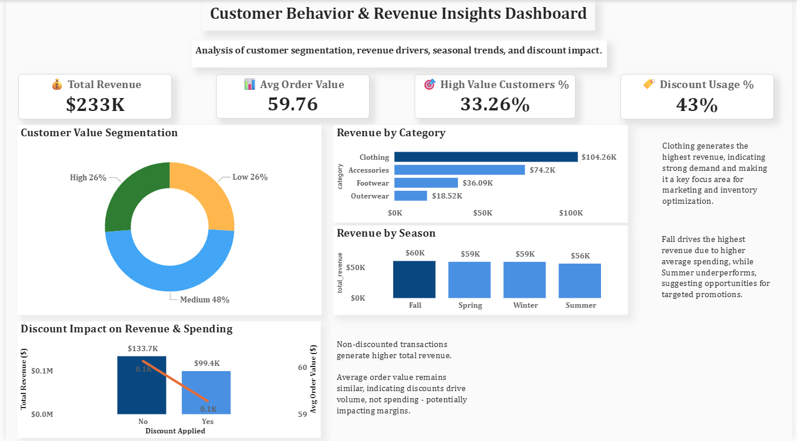

# 📊 Customer Behavior & Revenue Insights Dashboard

## 📌 Problem Statement

A retail company wants to understand customer purchasing behavior to improve sales, customer engagement, and profitability.

This project analyzes customer data to uncover:
- Key revenue drivers
- Customer segmentation patterns
- Seasonal trends
- Impact of discounts on purchasing behavior

## 🛠 Tools & Technologies

- Python (Pandas, NumPy)
- SQL (MySQL)
- Power BI

## 🔄 Project Workflow

1. Data Cleaning & Transformation using Python
2. Data Analysis using SQL
3. Data Visualization using Power BI
4. Insight Generation & Business Recommendations

## 📊 Dashboard Preview

## 🔍 Key Insights

- Clothing category generates the highest revenue, making it the primary business driver.
- Fall season contributes the highest revenue due to higher average spending.
- Discounts increase purchase volume but do not significantly impact average order value.
- Medium-value customers form the largest segment, providing upselling opportunities.

## 💡 Business Recommendations

- Focus on high-performing categories like Clothing for inventory and marketing optimization.
- Optimize discount strategies to prevent margin loss.
- Target low-performing seasons like Summer with promotional campaigns.
- Convert medium-value customers into high-value customers through targeted strategies.

## 📁 Project Structure

- `customer_shopping_behavior.csv` → Dataset  
- `data_cleaning.ipynb` → Data preprocessing  
- `analysis_queries.sql` → SQL analysis  
- `powerbi_dashboard.pbix` → Power BI dashboard  
- `dashboard_preview.png` → Dashboard snapshot  

## ⭐ What Makes This Project Unique

- End-to-end data pipeline (Python → SQL → Power BI)
- Business-focused insights, not just visualizations
- Discount impact analysis highlighting margin inefficiencies
- Clean and professional dashboard design

## 🚀 Future Improvements

- Add profit/margin analysis for deeper business insights
- Build customer lifetime value (CLV) model
- Implement predictive analytics (sales forecasting, churn analysis)
